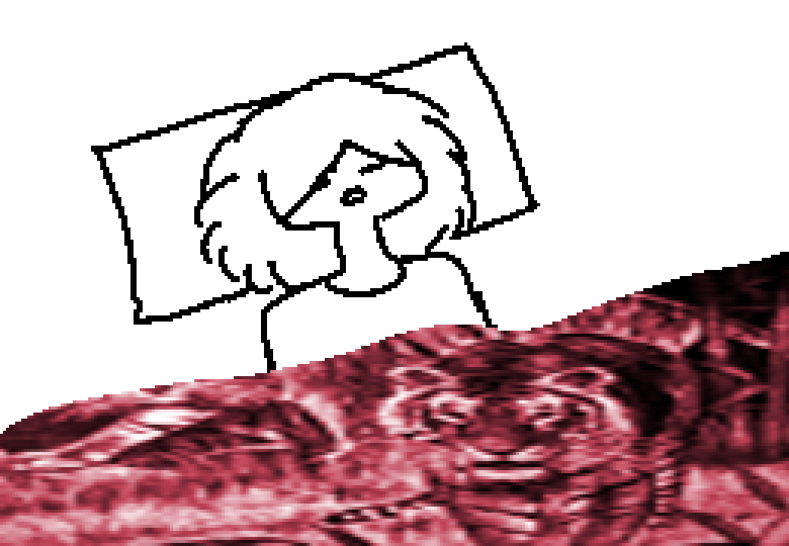
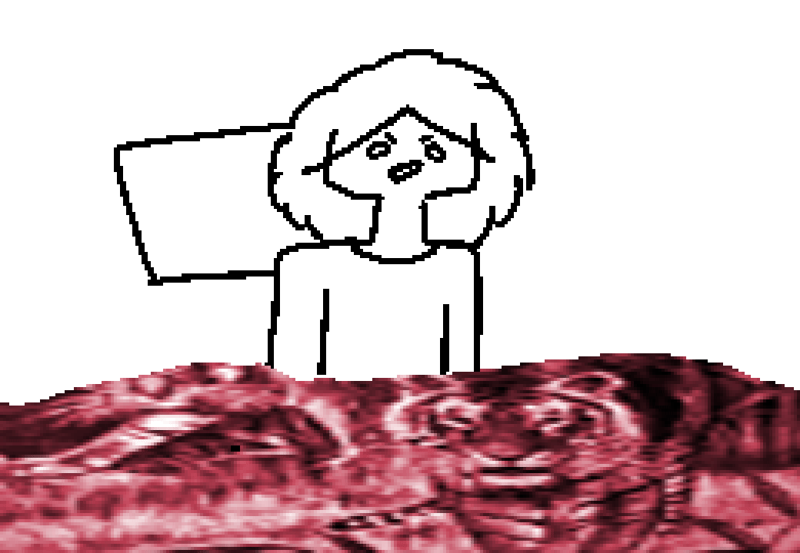

## La Escena Muerta

## [Capitulo 1: Domingo por la Mañana] ==>

Tu nombre es Oliver.

Hasta hace poco estabas profundamente dormido, pero el sonido de una banda ensayando, proveniente de la planta de abajo, te desperto.
Por lo general no te molesta la musica fuerte, pero la voz del vocalista te resulta intolerable y no te deja conciliar el sueño.

¿Que es lo proximo que haras?
## Levantarse.

Despues de 5 minutos dando vueltas por la cama, lograstes levantarte.
Cada minuto que pasa el vocalista pierde mas la verguenza y canta mas fuerte. Sientes que sera un dia largo.
## Inspeccionar cuarto.

Vives en el segundo piso de una modesta casa. La casa es propiedad de tu amigo Rafael, el cual se apiado de ti y te dejo habitar aqui.
Aparte de camas, cuentan con un ropero en el que los dos guardan todas sus cosas. Las puertas de madera constantemente se caen al suelo, cada ves que pasa, una fuerte nube de polvo se desprende del suelo.

No, el piso no tiene baldosas.

Compartes el cuarto con tu amigo Carlos, un autentico ñoñaso, el cual no parece estar. Seguramente se adelanto y empezo a desayunar sin ti.
Tambien cuentan con un Xbox. Carlos un dia llego con el cacharro, cuando lo encendia, tres luces rojas salian del logo, y no daba imagen. Tu amigo lo abrio, movio unas cosas y desde entonces funciona. 

Un autentico ñoñaso.
## Inspeccionar al cadaver de la cama.

No sabes de donde salio. Ayer cuando te acostastes, no estaba...

Acercas la mano temblorosamente, tomas la cobija, la jalas y...
## ===>

Es solo Carlos, que a diferencia de ti, tiene el sueño pesado, y no le importa en lo mas minimo el fuerte sonido, ni el pesimo estilo del vocavolista.
## Despertarlo.

Ocuparas refuerzos para la discusion que estas apunto de tener en el piso de abajo.

Carlos siempre te apoya, aunque estes siendo un completo idiota.

Es bueno tenerlo.
## ===>

```
CARLOS: ¿Dios Oliver, que quieres?
OLIVER: Buenos dias campeon.
OLIVER: Ocupo tu ayuda.
OLIVER: No se si te has dado cuenta, pero hay un tipo cantando como la mierda en el mismo metro cuadrado que yo, y eso es imperdonable.
OLIVER: Asi que iremos abajo, le pediremos amablemente que se calle y volveremos a dormir tranquilamente.
OLIVER: ¿Que te parece?
CARLOS: Si tanto te importa, ¿Porque no vas tu?
CARLOS: Aparte, dices lo mismo de todas las bandas que vienen a tocar, pero luego escuchas a tus bandas raras con tipos gritando y gimiendo, y cuando te pregunto, me dices que son geniales y que no tengo nada de artistico.
OLIVER: Aver, en primera, cantar mal es un estilo, pero este tipo no lo hace aproposito, ni como recurso musical, simplemente es malo. Tu y Rafael son demasiados amables con estos tipos que vienen a ensayar.
OLIVER: Y en segunda, sabes que a mi Rafael nunca me hace caso.
OLIVER: Ademas, te lo estoy pidiendo amablemente :)
CARLOS: Esta bien, pero tu haces el desayuno. Siempre hacemos que rafael lo haga y ya me da algo de pena.
OLIVER: Va, pero solo porque creo que le escupe a mi comida cuando no veo.
```
## ===>

Carlos y tu se apoximan a la puerta.
Es domingo por la mañana, y el sol encandila.

Actualmente trabajas con Carlos en un Kiosko cerca de casa.
Con el sueldo no les alcanza para rentar una casa, por lo que viven con Rafael en lo que consiguen un mejor empleo.
Carlos esta de vacaciones, a punto de entrar a su ultimo año en la universidad.
Dice que cuando salga, se ira inmediatamente a la Ciudad y conseguira un buen empleo.
Le crees.
Estas conciente de lo talentoso que es, pero hay algo que te preocupa, ¿que haras entoneces?. No crees que consigas un mucho empleo y la universidad no es para ti, no hay nada que de verdad te interese y a tu edad, te daria cosa estar entre jovenes en la escuela.

Intentas no pensar mucho en el tema, cada que lo haces te pones triste, pues, aunque no se lo digas nunca, Carlos es tu mejor amigo.
## ===>

La puerta lleva directo a una escalera, literalmente a una ESCALERA.
Antes habia una ESCALERA, con escalones y todo, pero lo quitaron.
No es que tu estuvieras ahi cuando paso, ni si quiera llegaste a ver esa ESCALERA, pero la pared sin enjarrar que forma la figura de una escalera no deja mucho a la imaginacion. Siempre le has querido preguntar a Rafa que fue lo que paso, pero siempre te da cosa, no quieres ser grosero o algo asi.
## Acercar escalera.

Con el pie, tratas de levantar la escalera y acercarla.
## Bajar.

Tienes los dos pies en la escalera, ya estas pensando en que vas a decirle a la banda para convencerlos de sacar a su vocalista, cuando...
## ===>

## ===>


Carlos te logra agarrar a tiempo.

Por un momento la musica ceso, pero poco despues de un rato volvieron a tocar.
```
CARLOS: ¿Que paso?
OLIVER: ¿Te que crees?
CARLOS: Gritale a Rafa.
OLIVER: La ultima vez que paso esto, la pared se rallo y se enojo.
OLIVER: No se ni porque le importa, si la pared ni esta enjarrada.
CARLOS: Bueno, es su casa, deberias de respetar su propiedad.
OLIVER: Carajo.
```
## Gritar a Rafa.

Le gritas con todas tus fuerzas, pero nadie responde.

La musica no deja lugar a tu voz para propagarse.
## Ser Carlos.


Ahora eres Carlos.

Ves como tu amigo grita sin parar sin obtener una respuesta.
Es el año 2017, ya nadie se comunica a la lejania con gritos, Rafael y tu tienen celulares, pero dejaras que Oliver grite un rato mas.
## LLamar a Rafael.

Despues de 2 minutos de ver a tu amigo gritar, decides llamar y decir que acomoden la escalera.

Estas marcando, pero escuchas un fuerte golpe.
## Investigar.

No esta Oliver
## ===>

Te acercas a la puerta y en el suelo del piso ves a tu amigo tirado.
## Ser Oliver.

Estas en el suelo.

Por un momento te parecio buena idea saltar desde arriba. Pensaste que aguantarias sin problemas y antes de que lo pensaras demasiado, ya habias saltado.

Estas hecho mierda.

La parte buena es que la musica paro, la mala es todo lo demas.
Consideras ceder y simplemente hecharte a dormir.
Con la euforia, no abra ningun mal cantante haciendo de las suyas en tus sueños.
Al final no fue un dia largo.

Buenas noches Oliver.
## ===>

```
RAFAEL: ¿Que carajos?
```
