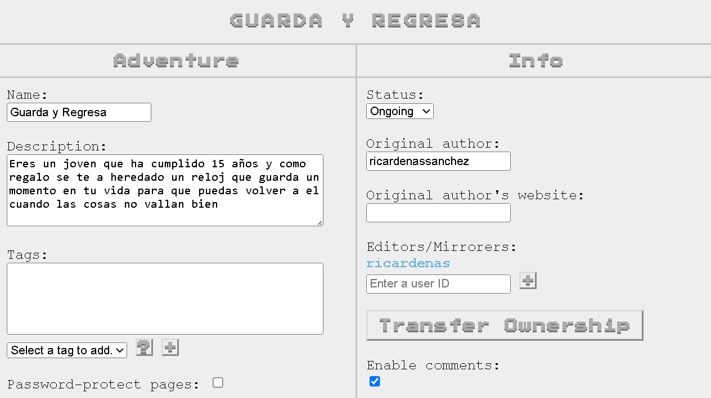

hola. 
hoy estoy emocionado de anuncia que MI COMIC FEO ESTA TAMBIEN PUBLICADO EN MS PAINT FAN ADVENTURE, Y PUEDEN VISITARLO [CLICKEANDO AQUI.](https://mspfa.com/?s=72160&p=1)

en verdad es una tonteria, pero me hace mucha ilusion ver el comic publicado en la pagina. estoy seguro de que el ricardo de 10 años se volveria loco si se enterara de esto.

algo curioso de lo que me di cuenta de que, es que mi cuenta de mspfa ya tenia una historia, a la cual nunca subi nada:

no recuerdo cuando hice esto, pero sospecho que fue cuando tenia como 14 años, y creo que tambien hice alguno que otro panel en inkscape, pero no subi nada porque me intimido la horrible interfaz que tiene la pagina para subir cosas. ANDREW HUSSIE, SI ESTAS LEYENDO ESTO, ME OFRESCO VOLUNTARIAMENTE A REHACER TU CAGADERO DE PAGINA. POR FAVOR DAME TRABAJO EN WHAT PUMPKIN, PUEDO BARRER O LO QUE SEA, TE LO SUPLICO.

tambien he estado subiendo de a poco paneles al comic. en la anterior entrada de esta cosa, cuando anuncie que estaba haciendo el comic, solo tenia 3 paneles, y ahora son 16. no tengo idea de que tanto se valla a extender, pero espero que no mucho, si no tendre que hacerle la mata osos a mi propia creacion y darle un final mierdero. 
el tema es que el comic solo nacio como una idea rapida para demostrarme que podia hacer comics y que no era para tanto. las ideas de verdad """buenas""" siguen atrapadas en mi cabeza, y estan suplicando por salir. entonces me urge que esta mierda acabe.

y nada. 
me siento muy feliz con mi nueva personalidad de creador. 
:)
