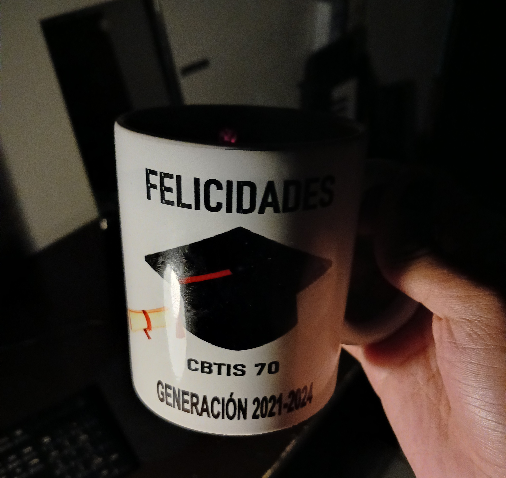

cuando sali del cbtis lo unico que me dieron (aparte de un certidicado) fue una taza. 
una taza con dulces y lapizeras adentro, y la frase impresa: "has completado una meta, ahora conquista tus sueños" 
todo el tema de la taza me ofendio profundamente, pues la taza no solo era un pesimo regalo de graduacion, si no que tambien era un constante recordatorio de mis 3 años en el cbtis. 
los 3 años me resultaron bastante turtuosos, pues no solo estaba estaba estudiando una carrera que no me interesaba en lo mas minimo, si no que tambien estaba rodeada de gente que no entendia y no me entendia. 
si hoy dia me preguntas como funciona un sistema de refrigeracion no solo no te voy a responder, si no que tambien te voy a mentar la madre de todas las formas posibles. 
los 3 años de carrera estuve imaginandome mi vida en otro grupo, estudiando programacion en la mañana rodeado de gente que si me entendia. 
estoy seguro de que en segundo semestre tuve la oportunidad de cambiarme, pero en uno de mis clasiscos autosaboteos no hice nada, pero eso es otro tema :p 
eso representaba para mi la taza. un constante recordatorio de los 3 años que perdi y de toda la represion y frustracion que vivi. 
como respuesta yo converti la taza en un cenicero. 
no me gusta fumar, odio fumar. no me genera ningnuna sensacion aparte de autodesprecio, detesto como huele y como me hace sentir. he pasado toda mi vida viendo a mi padre fumar unos 3 cigarros al dia, siempre considere fumar algo estupido y me prometi jamas hacerlo. 
no me gusta fumar pero me gusta lo que representa. fumar es una declaracion de principios. es una forma de decirle al mundo que no te importa el futuro, que no te importa morir. 
es la principal actividad del decadente y eso hacia yo, aspirar a decadencia. 
el tema es que me pareia ironico usar la taza como cenicero. 
asi he sido por mucho tiempo. un resentido que se pelea con tazas por cosas que ya pasaron. 
no puedo seguir asi, es hora de aceptar todo lo que paso y dejar de pensar en lo que no fue. 
me decide de todos los cigarros y de las colillas. converti mi taza en un ataza normal. 
me siento mas feliz asi. 

